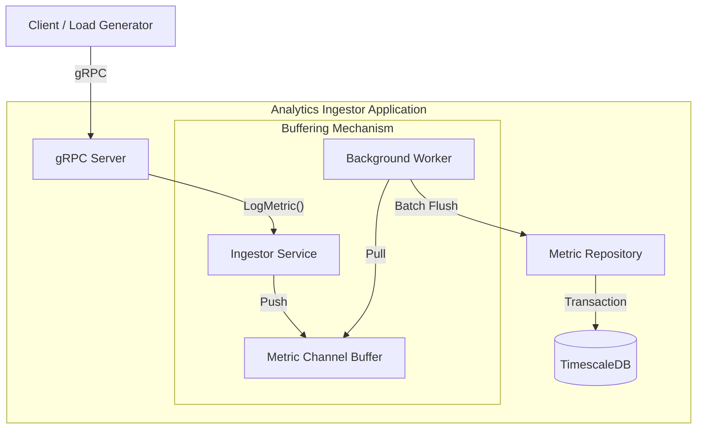

# High Level Design (HLD) - Analytics Ingestor

## 1. Overview

The **Analytics Ingestor** is a high-throughput, low-latency service designed to ingest log metrics from various services. It accepts metrics via gRPC, buffers them in memory to optimize write performance, and persists them into a time-series database (TimescaleDB) in batches.

## 2. Design Goals

- **High Throughput**: Capable of handling bursts of incoming metrics without blocking clients.
- **Asynchronous Processing**: Decouples ingestion from persistence using internal buffering.
- **Efficient Persistence**: Uses batch processing to minimize database round-trips.
- **Data Integrity**: Uses database transactions to ensure atomic batch writes.

## 3. System Architecture

The system follows a layered architecture, separating communication, business logic, and storage concerns.

### 3.1 Components

1.  **gRPC Client**: Generates load or sends real application metrics (e.g., `cmd/client`).
2.  **gRPC Handler**: Defines the interface (`LogMetricsRequest`) in `pkg/api/v1`.
3.  **Ingestor Service**: Core logic.
    - **Buffer**: A generic Go channel to store incoming requests temporarily.
    - **Background Worker**: A standard Go routine that listens to the channel and a ticker.
4.  **Repository Layer**: Handles database interactions using `pgx` driver.
5.  **TimescaleDB**: PostgreSQL extension optimized for time-series data.

## 4. Architecture Diagram (Mermaid)

## 5. Data Flow

1.  **Ingestion**:
    - Client sends `LogMetricsRequest`.
    - `IngestorService` validates and pushes the request into a buffered channel.
    - Response is returned immediately to the client (ACK).
2.  **Buffering**:
    - The metric sits in the channel until the batch size is reached OR the flush interval timer ticks.
3.  **Persistence**:
    - The Background Worker drains the batch from the channel.
    - Use `TransactionManager` to start a DB transaction.
    - `MetricRepository` performs a `COPY` or `INSERT` statement for the entire batch.
    - Transaction is committed.

## 6. Technology Stack

- **Language**: Go (Golang)
- **Protocol**: gRPC (Protobuf)
- **Database**: TimescaleDB (PostgreSQL 14)
- **Driver**: `pgx/v5`
- **Containerization**: Docker & Docker Compose
