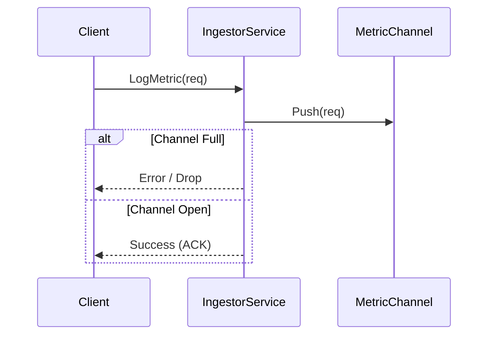
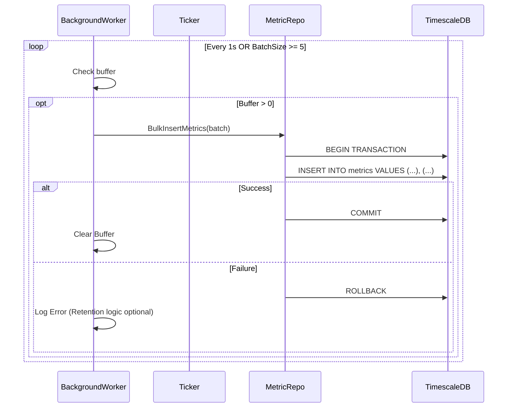

# Low Level Design (LLD) - Analytics Ingestor

## 1. Code Structure & Modules

The project follows a Clean Architecture / Hexagonal approach.

| Directory             | Purpose                                                           |
| --------------------- | ----------------------------------------------------------------- |
| `cmd/server`          | Application Entrypoint. Initializes Config, DB, runs Server.      |
| `internal/app`        | DI Container. Wires up Services and Repositories.                 |
| `internal/service`    | Business Logic (`IngestorService`). Handles buffering & flushing. |
| `internal/repository` | Data Access (`MetricRepository`). SQL queries.                    |
| `pkg/api/v1`          | Generated gRPC Protobuf definitions.                              |
| `pkg/tm`              | Transaction Manager utility for wrapping logic in `pgx.Tx`.       |

## 2. Key Structures and Interfaces

### 2.1 Ingestor Service

Located in: `internal/service/ingestor.go`

```go
type IngestorService struct {
    metricChan         chan *pb.LogMetricsRequest
    metricRepo         repository.MetricRepository
    transactionManager tm.TransactionManager
    // Constants: BatchSize (5), FlushInterval (1s)
}

// Methods
func LogMetric(ctx, req) (*Response, error) // Pushes to channel
func StartBatchProcessing(ctx)              // Starts Goroutine
func startBatchWorker(ctx)                  // Select loop (Ticker vs Channel)
func flushBatch(ctx, batch)                 // Calls Repo inside Transaction
```

### 2.2 Metric Repository

Located in: `internal/repository/metric.go`

```go
type MetricRepository interface {
    BulkInsertMetrics(ctx context.Context, batch []*pb.LogMetricsRequest) error
}
```

### 2.3 Database Schema (TimescaleDB)

Table: `metrics` (Hypertable chunked by `time`)

| Column         | Type               | Constraints | Description                                |
| -------------- | ------------------ | ----------- | ------------------------------------------ |
| `time`         | `TIMESTAMPTZ`      | `NOT NULL`  | Time of the event (Primary Partition Key). |
| `service_name` | `TEXT`             | `NOT NULL`  | Originating service identifier.            |
| `metric_name`  | `TEXT`             | `NOT NULL`  | Name of the metric (e.g., `cpu_usage`).    |
| `value`        | `DOUBLE PRECISION` | -           | The numerical value or reading.            |

**Indexes**:

- `metrics_time_idx` (Desc) - Created automatically by TimescaleDB.

## 3. Sequence Diagrams (Mermaid)

### 3.1 Log Metric (Request Path)

This path is optimized for low latency.



### 3.2 Batch Flush (Background Path)

This path optimizes database interactions.



## 4. Configuration Parameters

- **BatchSize**: `5` items (Hardcoded for demo, usually higher e.g. 1000).
- **FlushInterval**: `1 second`.
- **Channel Buffer**: `10` slots.
- **Database Pool**: Managed by `pgxpool`.
